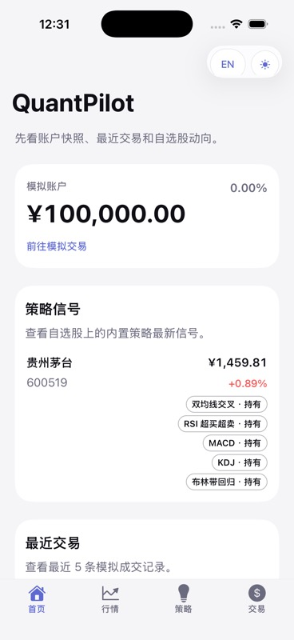
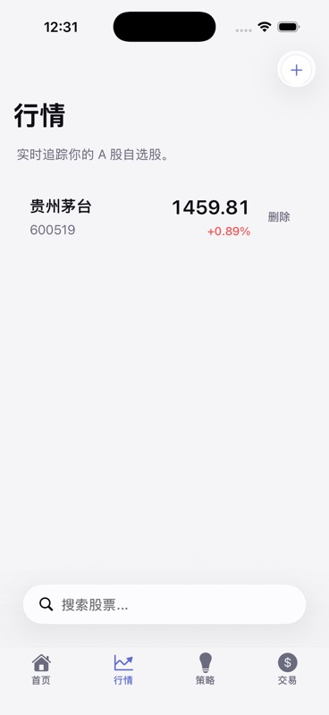
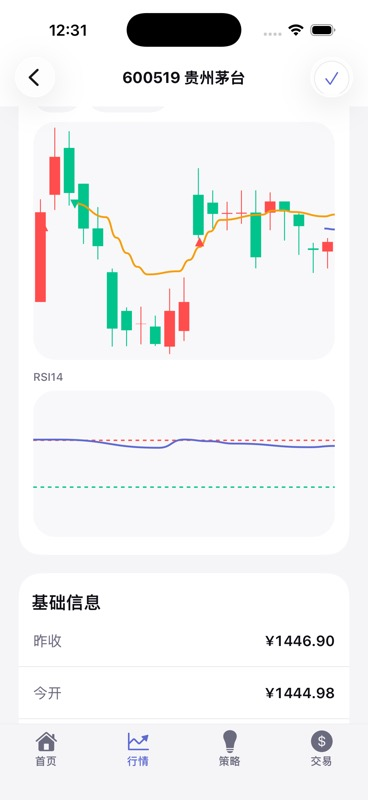
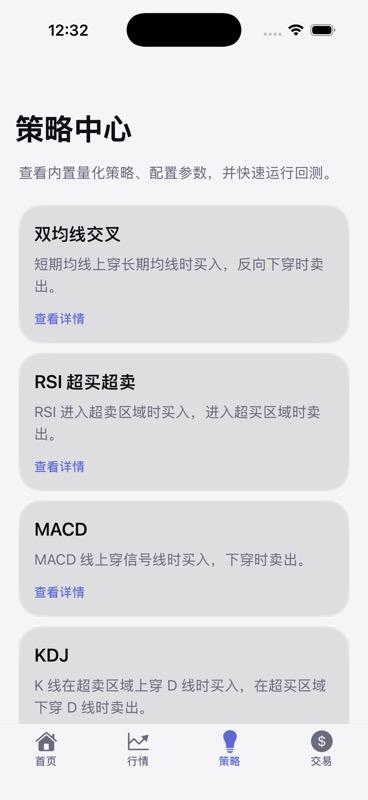
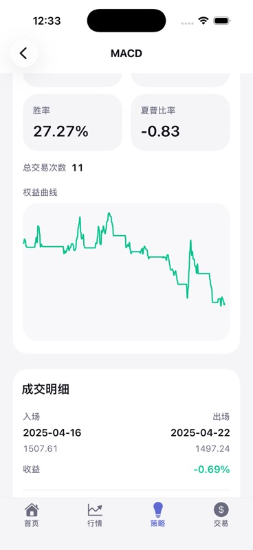
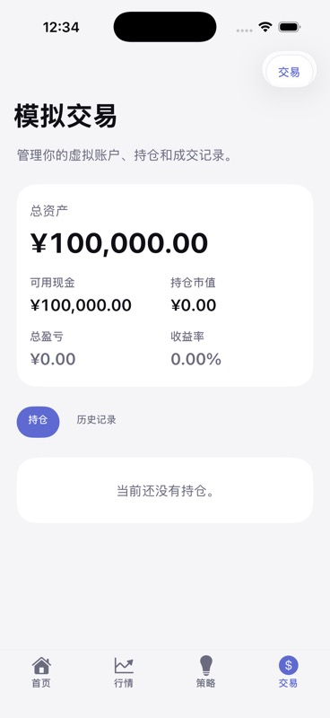

# Quant Pilot

A mobile app for quantitative strategy research and paper trading on China A-shares. Not a brokerage — no real money, no live orders. The goal is to help you explore built-in strategies, watch market signals, simulate trades, and review performance.

Built with React Native + Expo on the frontend and FastAPI + PostgreSQL on the backend. Market data comes from the public Tencent Finance API.

## Features

- **Home dashboard** — account snapshot, latest signals across your watchlist, and recent trade history at a glance.
- **Market** — A-share watchlist with real-time quotes and a stock detail page showing candlesticks, MA overlays, RSI, and buy/sell markers from any built-in strategy.
- **Strategy center** — five built-in strategies (Dual MA, RSI, MACD, KDJ, Bollinger Bands) with configurable parameters, equity curve, and per-trade log.
- **Paper trading** — ¥100,000 virtual account with buy/sell, live P&L, positions, and history.

Languages: 简体中文 + English (follows device locale).

## Tech stack

| Layer | Stack |
|-------|-------|
| Frontend | React Native, Expo (managed), Expo Router, NativeWind, i18next, wagmi-charts |
| Backend | Python 3.12, FastAPI (async), SQLAlchemy 2 async, Alembic |
| Database | PostgreSQL 16 (via docker-compose) |
| Data source | Tencent Finance API (quotes + historical kline, no token required) |
| Package managers | pnpm (frontend), uv (backend) |

## Scope

- A-shares only (Shanghai + Shenzhen, 6-digit codes)
- CNY only
- No real trading, no brokerage integration, no automated order execution
- No personalized financial advice

## Getting started

### Prerequisites

- Node.js 20+ and pnpm
- Python 3.12+ and [uv](https://docs.astral.sh/uv/)
- Docker (for PostgreSQL)
- Xcode (iOS Simulator) or Android Studio (Android Emulator)
- Expo Go app on your simulator/device

### 1. Start the database

```bash
docker compose up -d
```

### 2. Backend

```bash
cd backend
uv sync
uv run alembic upgrade head
uv run uvicorn main:app --host 127.0.0.1 --port 8000 --reload
```

The API will be available at `http://127.0.0.1:8000`. See `http://127.0.0.1:8000/docs` for the OpenAPI UI.

### 3. Frontend

```bash
cd frontend
pnpm install
pnpm start
```

Then press `i` to open in iOS Simulator or `a` for Android Emulator. Alternatively, scan the QR code with Expo Go.

## Testing

```bash
# Backend
cd backend && uv run pytest -q

# Frontend
cd frontend && pnpm tsc --noEmit && pnpm lint && node --test tests/theme-and-routes.test.mjs
```

## Project layout

```
quant-pilot/
├── backend/
│   ├── main.py
│   ├── routers/          # FastAPI route modules
│   ├── services/         # Business logic (backtest, quotes, trading)
│   │   └── strategies/   # Built-in strategy implementations
│   ├── schemas/          # Pydantic models
│   ├── models/           # SQLAlchemy ORM models
│   ├── migrations/       # Alembic migrations
│   └── tests/
├── frontend/
│   ├── app/              # Expo Router routes (tabs + stacks)
│   ├── components/       # Reusable UI primitives
│   ├── lib/              # API client and shared helpers
│   ├── locales/          # i18next translations (en, zh-CN)
│   └── tests/
├── docs/screenshots/
├── docker-compose.yml
├── AGENTS.md             # Claude + Codex collaboration workflow
└── CLAUDE.md
```

## Screenshots

| Home | Market list | Market detail |
|------|-------------|---------------|
|  |  |  |

| Strategy center | Strategy detail (MACD backtest) | Paper trading |
|-----------------|---------------------------------|---------------|
|  |  |  |
